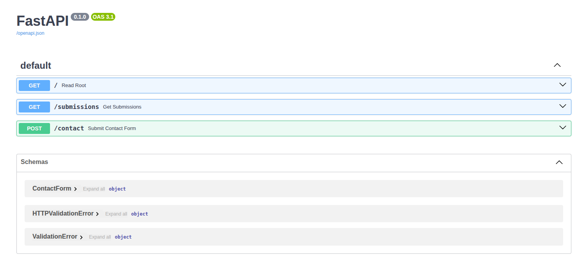

# Python Contact Form API & Database

A secure and robust backend API designed to handle contact form submissions. This project features a Python-based FastAPI server that performs data validation using Pydantic models. All submissions are securely saved to a PostgreSQL database, demonstrating a complete, professional data pipeline.


## Features
* **Data Validation**: Utilizes Pydantic for strict, type-safe validation of incoming data.

* **Secure Database Operations**: Connects to a PostgreSQL database and uses parameterized queries to prevent SQL injection attacks.

* **Two Core Endpoints**:

    * ```POST /contact```: Accepts and saves a new contact form submission.

    * ```GET /submissions```: Securely retrieves and displays all saved submissions.

* **Environment-Based Configuration**: Securely manages database credentials using a ```.env``` file.

## Technology Stack

### Getting Started
To get a local copy up and running, follow these simple steps.

### Prerequisites
* Python 3.8+
* An active PostgreSQL database instance.

### Installation
1. Clone the repository:
    ```sh
    git clone https://github.com/claytoncrispim/python-api-project.git
    ```
    ```sh
    cd python-api-project
    ```
2. Create and activate a virtual environment:
    ```sh
    python3 -m venv .venv
    source .venv/bin/activate
    ```
3. Install the required packages:
    ```sh
    pip install -r requirements.txt
    ```

4. Set up your environment variables:

* Create a copy of the example file: ```cp .env.example .env```

* Open the ```.env``` file and fill in your actual PostgreSQL database credentials.

### Running the Server
* Start the development server using Uvicorn:

    ```uvicorn main:app --reload```

* The API will be available at http://127.0.0.1:8000.

## API Endpoints
Once the server is running, you can access the interactive documentation provided by FastAPI at http://127.0.0.1:8000/docs.


### 1. Submit a Message
* Method: ```POST```
* URL: ```/contact```
* Request Body (JSON):
    ```sh
    {
    "name": "John Doe",
    "email": "john.doe@example.com",
    "message": "This is a test message."
    }
    ```
* Success Response (200 OK):
    ```sh
    {
    "status": "success",
    "message": "Contact form submitted successfully!"
    }
    ```
### 2. Retrieve All Submissions
* Method: ```GET```
* URL: ```/submissions```
* Success Response (200 OK):
    ```sh
    [
    {
        "id": 1,
        "name": "John Doe",
        "email": "john.doe@example.com",
        "message": "This is a test message.",
        "submitted_at": "2025-10-14T14:30:00.123Z"
    }
    ]
    ```

